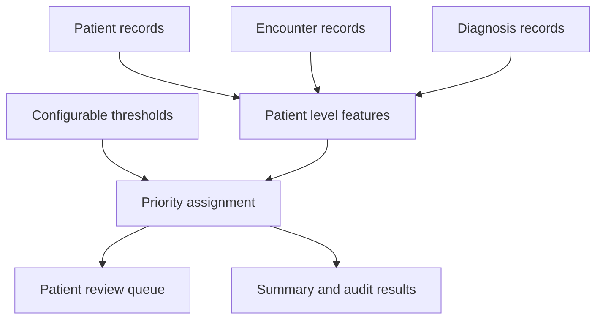

# Snowflake Patient Utilization and Care Management Analytics

I built this Snowflake SQL project to explore how hospital encounter and diagnosis data can help a care management team decide which patient records to review first.

The pipeline analyzes synthetic patient data and creates an explainable High, Medium, or Low review priority queue. Each result includes the utilization and diagnosis counts behind the assigned priority.

## Why I built this project

While working with patient intake and clinical documentation, I saw how important accurate and connected healthcare data can be. Information about a patient may exist across several records, but employees often have to review those records manually before they can understand the full picture.

I wanted to explore how SQL could organize that information into a consistent and understandable review list.

## How the pipeline works

The pipeline:

1. Loads synthetic patient, encounter, and diagnosis records.
2. Counts recent emergency department visits and inpatient admissions.
3. Counts each patient’s recorded chronic conditions.
4. Combines the patient level summaries.
5. Assigns a High, Medium, or Low review priority.
6. Creates a review queue, summary views, and validation results.

## Important design decision

A patient can have several encounters and several diagnoses. Joining both detailed tables directly can multiply the records.

For example, a patient with three encounters and two diagnoses could produce six joined rows. This would make the patient appear to have more hospital visits than they actually had.

To prevent this, I summarized encounters and diagnoses separately so that each summary contained one row per patient. I then joined those patient level summaries together.

## Features

* Configurable analysis period and priority thresholds
* Separate patient, encounter, diagnosis, configuration, result, and audit tables
* Emergency department and inpatient utilization counts
* Chronic condition counts
* Encounter cost and recency measures
* An explainable `priority_reason` for every patient
* Reusable patient queue and priority summary views
* Validation checks for missing patients, duplicate results, invalid values, date filtering, and priority rule consistency
* Fully synthetic data with no protected health information or credentials

## Repository structure

| Path                             | Purpose                                                                               |
| -------------------------------- | ------------------------------------------------------------------------------------- |
| `sql/01_setup.sql`               | Creates the schema, source tables, configuration table, result table, and audit table |
| `sql/02_seed_synthetic_data.sql` | Loads 15 synthetic patients, 35 encounters, and 21 diagnoses                          |
| `sql/03_build_results.sql`       | Calculates patient level features and assigns review priorities                       |
| `sql/04_analysis_views.sql`      | Creates the patient review queue and priority summary views                           |
| `sql/05_data_quality_tests.sql`  | Runs data quality and business rule validation checks                                 |
| `sample_output/`                 | Contains the expected patient queue and priority summary                              |
| `tests/`                         | Contains automated tests for the expected output                                      |
| `docs/`                          | Contains the data dictionary and technical documentation                              |

## Run the project in Snowflake

1. Sign in to Snowflake and open a SQL worksheet.
2. Select a warehouse you have permission to use.
3. Run `sql/01_setup.sql`.
4. Run `sql/02_seed_synthetic_data.sql`.
5. Run `sql/03_build_results.sql`.
6. Run `sql/04_analysis_views.sql`.
7. Run `sql/05_data_quality_tests.sql`.
8. Confirm that the validation checks return `PASS` and the exception queries return zero rows.
9. Compare the results with the files in `sample_output/`.

The setup script uses `CREATE OR REPLACE TABLE`, so it should only be run in the project’s designated practice schema.

## Expected results

The synthetic dataset produces one result for each of the 15 patients:

| Priority | Patients |
| -------- | -------: |
| High     |        5 |
| Medium   |        6 |
| Low      |        4 |

Patient 005 has an emergency department encounter outside the configured analysis period. That older encounter is excluded, confirming that the date filter works correctly.

## Validation

I included SQL validation queries that check:

* Every patient appears once in the final result
* No patient is missing from the review queue
* No duplicate patient results are created
* Priority values are valid
* The expected High, Medium, and Low totals are produced
* Encounters outside the analysis period are excluded
* Each priority agrees with the configured business rules

The SQL files were also checked with SQLFluff using the Snowflake dialect, and the transformation logic produced the expected 15 patient result using the included synthetic data.

## Technologies and skills

* Snowflake SQL
* Relational data modeling
* Common table expressions
* Conditional aggregation with `COUNT_IF`
* Safe joins across one to many tables
* Configuration driven business rules
* Views and analytical reporting
* Data quality testing
* Technical documentation
